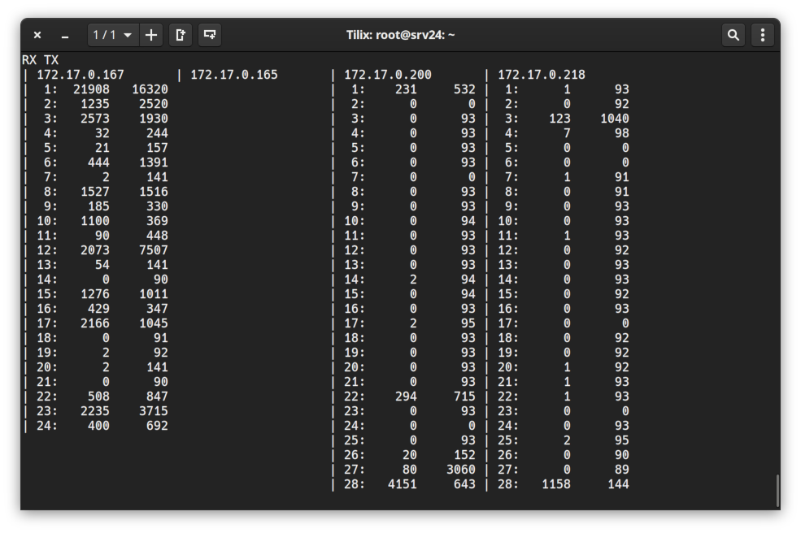

## Tiny CLI utilite for monitoring PPS on the D-Link switches by ports

Usage:
```bash
pps <ip0> <ip1> ... <ipN>
```
`pps_conf.json` describes SNMP OIDs for getting PPS by the switch model name and must be located in `/opt` 
(todo: make path to config as variable)

The SNMP community `public` is hardcoded into `switch.go` as constant (todo: make as variable)


